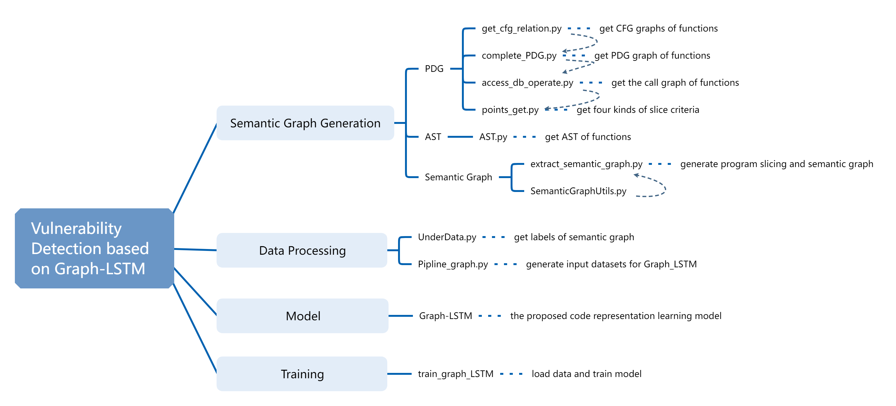

# Vulnerability Detection

## Downstream tasks of code representation

**Vulnerability Detection** aims to mitigate and detect software vulnerabilities in real-world software products.

## Dataset

The dataset we used is provided by Li et al. (SySeVR), which is collected from SARD and NVD and contains  a total of 15,592  C/C++ programs.

### Data Format

1. resources/dataset/OJ-Data-*/programs.pkl is stored in pickle format. Each row in this file represents one function and its label.  One row is illustrated below.

   - **Testid:** the id of CVE or SARD programs
   - **tree-graph:** the generated semantic graph of Testid
   - **label:** the class-label of the semantic graph.


### Data Statistics

Data statistics of the dataset are shown in the below table:

|       | #Programs | #semantic graphs |
| ----- | :-------: |:-------: |
| SARD |  14,000  | 387,695 |
| NVD  |  1,592  | 14,640 |


You can get data using the following command.

```python
import os
import pandas as pd
data_path = '../resources/dataset/OJ-All/programs.pkl'
if os.path.exists(data_path):
    data = pd.read_pickle(data_path)
```

## Source code



## Pipeline_graph.py: Prepare input for our grah-lstm model

We also provide a pipeline that generates inputs for our model on this task. 
### Dependency

- gensim
- networkx
- dgl
- nltk
- numpy
- pandas
- scikit_learn
- torch

### Joern

Use joern to parse source code: the input is source code files, and the output is a file named .joernIndex.


## Training and Evaluation Entry

We provide a script to train and evaluate our model for this task, and report Accuracy score

```shell
python Entry/train_graph_lstm.py
```

### Result

```bash
OJ-All
[Epoch: 100/100] Train Loss: 0.0526, Val Loss: 0.0540, Train result: 0.9773022361144506, Test result: 0.9660623692625808
```

